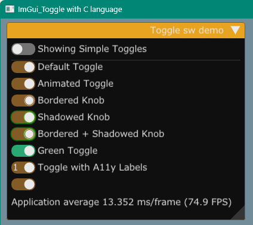
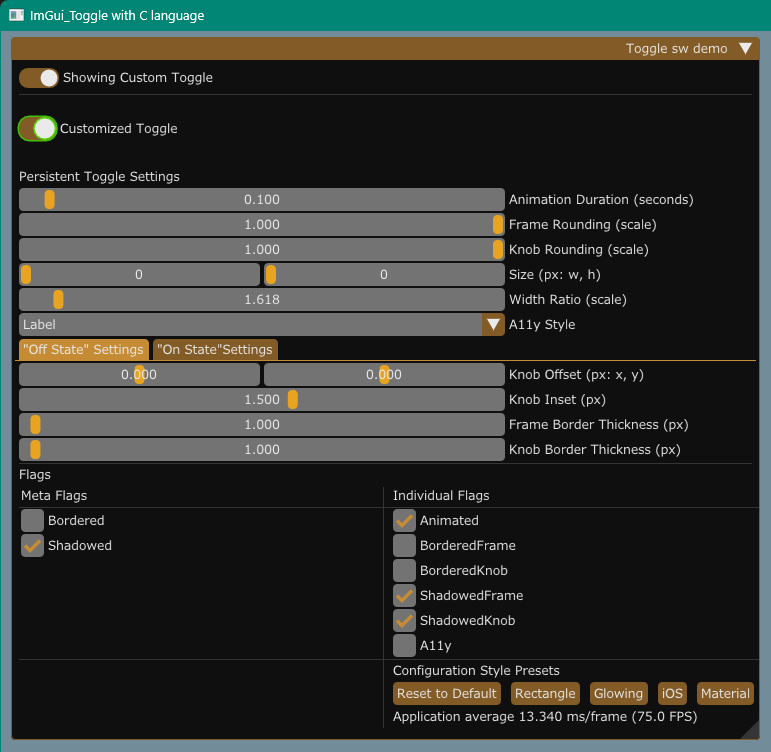

### cimgui_toggle 

---

`cimgui_toggle` is C language wrapper for `imgui_toggle` library 

https://github.com/cmdwtf/imgui_toggle



### Prerequisites

---

1. Windows OS  
- MSys2/MingW tools installed.  
Install at least,

   ```sh
   pacman -S mingw-w64-ucrt-x86_64-{make,gcc,glfw,pkgconf}
   ```

1. Linux OS (Ubuntu / Debian families)  
Install at least,

   ```sh
   $ sudo apt install make pkgconf xorg-dev lib{opengl-dev,gl1-mesa-dev,glfw3,glfw3-dev}
   ```

### Build and run

---

1. Getting sources

   ```sh
   git clone --recurse-submodules https://github.com/dinau/cimgui_toggle
   ```

1. Build and run  C langugae demo

   ````
   cd cimgui_toggle/demo/c
   make run
   ````

1. Build and run  C++ langugae demo

   ````
   cd cimgui_toggle/demo/cpp
   make run
   ````

### Custom window

---


